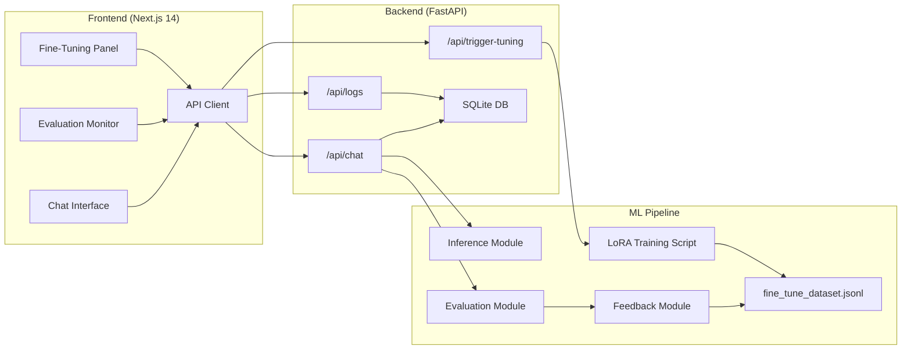
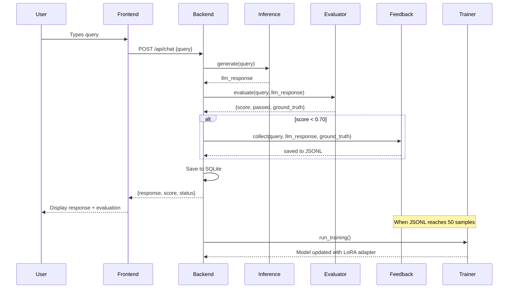

# Self-Improving LLM Pipeline — Implementation Plan

Build an automated feedback loop system where LLM outputs are evaluated using semantic similarity, low-quality responses are collected, and the model is iteratively improved through LoRA fine-tuning.

## Architecture Overview



## Tech Stack

| Layer | Technology | Purpose |
|-------|-----------|---------|
| **Frontend** | Next.js 14+ (App Router), TypeScript, TailwindCSS, Shadcn/ui | Dashboard UI with chat, evaluation monitor, analytics |
| **Backend** | FastAPI, SQLAlchemy 2.0+, aiosqlite, Pydantic v2 | REST API, async DB operations, request validation |
| **ML - Inference** | `Qwen/Qwen2.5-0.5B-Instruct`, HuggingFace Transformers | Small LLM for generating responses |
| **ML - Evaluation** | `sentence-transformers/all-MiniLM-L6-v2` | Cosine similarity scoring against ground truth |
| **ML - Training** | PEFT, LoRA, trl (SFTTrainer) | Parameter-efficient fine-tuning |
| **Storage** | SQLite | Interaction logs, evaluation metrics |

---

## User Review Required

> [!IMPORTANT]
> **Model Choice**: The plan uses `Qwen/Qwen2.5-0.5B-Instruct` (0.5B params) — runs on CPU/low-end GPU. If you have a GPU with ≥8GB VRAM, we could use a larger model like `Qwen/Qwen2.5-1.5B-Instruct`. Confirm which you prefer.

> [!IMPORTANT]
> **GPU vs CPU**: LoRA fine-tuning is GPU-intensive. On CPU-only machines, training will be slow but functional for demonstration. The inference module can run on CPU. Please confirm your hardware setup.

> [!WARNING]
> **HuggingFace Model Download**: First run will download ~1GB (Qwen2.5-0.5B) + ~90MB (MiniLM). Ensure you have storage and bandwidth.

## Open Questions

1. **Ground truth scope** — Do you have a specific domain (coding, QA, medical, etc.) in mind for the ground truth reference file, or should I create a general-knowledge sample dataset?
2. **Fine-tune threshold** — The plan uses 50 bad samples before triggering auto fine-tune. Would you prefer a different threshold?
3. **Authentication** — Should the API have any auth (API keys), or is this a local-only demo?

---

## Proposed Changes

### Project Directory Structure

```
Self improving system/
├── frontend/                    # Next.js 14 App
│   ├── src/
│   │   ├── app/
│   │   │   ├── layout.tsx       # Root layout with fonts, metadata
│   │   │   ├── page.tsx         # Dashboard page
│   │   │   └── globals.css      # Tailwind + custom styles
│   │   ├── components/
│   │   │   ├── ui/              # Shadcn/ui components
│   │   │   ├── ChatInterface.tsx
│   │   │   ├── EvaluationMonitor.tsx
│   │   │   ├── FineTuningPanel.tsx
│   │   │   └── DashboardLayout.tsx
│   │   └── lib/
│   │       ├── api.ts           # API client functions
│   │       └── utils.ts         # Shadcn utility
│   ├── package.json
│   ├── tailwind.config.ts
│   ├── tsconfig.json
│   └── next.config.ts
│
├── backend/                     # FastAPI Server
│   ├── app/
│   │   ├── __init__.py
│   │   ├── main.py              # FastAPI app, CORS, lifespan
│   │   ├── database.py          # Async SQLAlchemy engine + session
│   │   ├── models.py            # ORM models (InteractionLog)
│   │   ├── schemas.py           # Pydantic request/response schemas
│   │   ├── routers/
│   │   │   ├── __init__.py
│   │   │   ├── chat.py          # POST /api/chat
│   │   │   ├── logs.py          # GET /api/logs
│   │   │   └── tuning.py        # POST /api/trigger-tuning
│   │   └── services/
│   │       ├── __init__.py
│   │       └── ml_service.py    # Bridge to ML pipeline
│   ├── requirements.txt
│   └── run.py                   # Uvicorn entry point
│
├── ml_pipeline/                 # ML Core
│   ├── __init__.py
│   ├── config.py                # Model paths, thresholds, hyperparams
│   ├── inference.py             # Load Qwen model, generate responses
│   ├── evaluation.py            # Sentence-transformer cosine similarity
│   ├── feedback.py              # Write bad samples to JSONL
│   ├── trainer.py               # PEFT/LoRA fine-tuning script
│   ├── ground_truth.json        # Reference Q&A pairs
│   └── data/
│       └── fine_tune_dataset.jsonl  # Auto-generated training data
│
├── README.md
└── .gitignore
```

---

### Component 1: ML Pipeline

The foundational layer — must be built first since backend depends on it.

#### [NEW] [config.py](file:///c:/Users/harsh/Desktop/Self%20improving%20system/ml_pipeline/config.py)
- Central configuration: model IDs, similarity threshold (0.70), fine-tune trigger count (50), LoRA hyperparameters (r=8, alpha=32, dropout=0.05), output directories.

#### [NEW] [inference.py](file:///c:/Users/harsh/Desktop/Self%20improving%20system/ml_pipeline/inference.py)
- `InferenceEngine` class with lazy model loading
- `generate(prompt: str) -> str` method using Qwen2.5-0.5B-Instruct
- ChatML template formatting (`<|im_start|>user\n{prompt}<|im_end|>`)
- Configurable `max_new_tokens`, `temperature`, `top_p`

#### [NEW] [evaluation.py](file:///c:/Users/harsh/Desktop/Self%20improving%20system/ml_pipeline/evaluation.py)
- `EvaluationEngine` class loading `all-MiniLM-L6-v2`
- `evaluate(query: str, response: str) -> EvalResult` method
- Looks up closest match in `ground_truth.json` using query embedding
- Computes cosine similarity between response and ground truth answer
- Returns: `score`, `passed` (score ≥ 0.70), `ground_truth_answer`, `matched_query`

#### [NEW] [feedback.py](file:///c:/Users/harsh/Desktop/Self%20improving%20system/ml_pipeline/feedback.py)
- `FeedbackCollector` class
- `collect(query, bad_response, correct_response)` → appends to `fine_tune_dataset.jsonl`
- `get_sample_count() -> int` — reads line count of JSONL
- `should_trigger_training() -> bool` — count ≥ threshold
- JSONL format: `{"instruction": "...", "input": "", "output": "..."}`

#### [NEW] [trainer.py](file:///c:/Users/harsh/Desktop/Self%20improving%20system/ml_pipeline/trainer.py)
- `run_training()` function
- Loads base Qwen model + LoRA config
- Reads `fine_tune_dataset.jsonl` using HuggingFace `datasets`
- Uses `SFTTrainer` from `trl` with `SFTConfig`
- Saves adapter to `./ml_pipeline/checkpoints/`
- After training, clears the JSONL file (archives old data)

#### [NEW] [ground_truth.json](file:///c:/Users/harsh/Desktop/Self%20improving%20system/ml_pipeline/ground_truth.json)
- 30+ curated Q&A pairs for general knowledge evaluation
- Format: `[{"query": "...", "answer": "..."}]`
- Used as reference for semantic similarity scoring

---

### Component 2: Backend (FastAPI)

#### [NEW] [database.py](file:///c:/Users/harsh/Desktop/Self%20improving%20system/backend/app/database.py)
- Async SQLAlchemy engine with `sqlite+aiosqlite:///./backend/app.db`
- `AsyncSessionLocal` sessionmaker
- `get_db()` FastAPI dependency
- `init_db()` for table creation on startup

#### [NEW] [models.py](file:///c:/Users/harsh/Desktop/Self%20improving%20system/backend/app/models.py)
- `InteractionLog` ORM model:
  - `id` (PK), `timestamp`, `user_query`, `llm_response`, `similarity_score` (Float), `evaluation_status` (Passed/Flagged), `ground_truth_used` (str), `created_at`

#### [NEW] [schemas.py](file:///c:/Users/harsh/Desktop/Self%20improving%20system/backend/app/schemas.py)
- `ChatRequest(query: str)`
- `ChatResponse(response: str, score: float, status: str, ground_truth: str)`
- `LogEntry(...)` — mirrors DB fields
- `LogsResponse(logs: list[LogEntry], total: int)`
- `TuningStatus(message: str, samples_count: int, threshold: int, training_triggered: bool)`

#### [NEW] [main.py](file:///c:/Users/harsh/Desktop/Self%20improving%20system/backend/app/main.py)
- FastAPI app with lifespan handler (init DB on startup)
- CORS middleware (allow `localhost:3000`)
- Include routers: chat, logs, tuning

#### [NEW] [chat.py](file:///c:/Users/harsh/Desktop/Self%20improving%20system/backend/app/routers/chat.py)
- `POST /api/chat` → calls inference → evaluates → saves log → if flagged, calls feedback collector → returns response with score

#### [NEW] [logs.py](file:///c:/Users/harsh/Desktop/Self%20improving%20system/backend/app/routers/logs.py)
- `GET /api/logs?page=1&per_page=20` → paginated query of InteractionLog
- `GET /api/logs/stats` → summary stats (total queries, avg score, flagged count, training queue size)

#### [NEW] [tuning.py](file:///c:/Users/harsh/Desktop/Self%20improving%20system/backend/app/routers/tuning.py)
- `POST /api/trigger-tuning` → runs `trainer.run_training()` in a background task
- Returns status with sample count and whether training was triggered

#### [NEW] [ml_service.py](file:///c:/Users/harsh/Desktop/Self%20improving%20system/backend/app/services/ml_service.py)
- Singleton wrapper around ML pipeline modules
- Lazy initialization of InferenceEngine, EvaluationEngine, FeedbackCollector
- Provides `process_query(query) -> dict` orchestration method

---

### Component 3: Frontend (Next.js 14)

#### [NEW] Frontend project scaffold
- `npx -y create-next-app@latest ./frontend --yes --typescript --tailwind --app --src-dir --use-npm`
- `npx shadcn@latest init --defaults --yes` inside `frontend/`
- Add Shadcn components: `button`, `card`, `input`, `table`, `badge`, `progress`, `tabs`, `scroll-area`, `separator`

#### [NEW] [page.tsx](file:///c:/Users/harsh/Desktop/Self%20improving%20system/frontend/src/app/page.tsx)
- Main dashboard page with three-panel layout
- Left: Chat Interface, Right: Evaluation Monitor + Fine-Tuning Panel
- Dark theme with gradient accents

#### [NEW] [ChatInterface.tsx](file:///c:/Users/harsh/Desktop/Self%20improving%20system/frontend/src/components/ChatInterface.tsx)
- Message bubbles with user/assistant differentiation
- Input bar with send button
- Shows evaluation badge (score + status) on each assistant message
- Loading state with typing animation

#### [NEW] [EvaluationMonitor.tsx](file:///c:/Users/harsh/Desktop/Self%20improving%20system/frontend/src/components/EvaluationMonitor.tsx)
- Real-time log table: User Query | LLM Output | Score | Status
- Color-coded status badges (green = Passed, red = Flagged)
- Auto-refreshes every 5 seconds
- Scrollable with pagination

#### [NEW] [FineTuningPanel.tsx](file:///c:/Users/harsh/Desktop/Self%20improving%20system/frontend/src/components/FineTuningPanel.tsx)
- Progress bar showing "45/50 samples until next fine-tune"
- Manual "Trigger Fine-Tuning" button with confirmation
- Training status indicator (Idle / Training / Complete)
- Stats: total flagged responses, last training timestamp

#### [NEW] [api.ts](file:///c:/Users/harsh/Desktop/Self%20improving%20system/frontend/src/lib/api.ts)
- `sendMessage(query: string)` → POST `/api/chat`
- `fetchLogs(page, perPage)` → GET `/api/logs`
- `fetchStats()` → GET `/api/logs/stats`
- `triggerTraining()` → POST `/api/trigger-tuning`

---

## Data Flow



---

## Verification Plan

### Automated Tests

1. **Backend API tests**:
   ```bash
   cd backend && python -m pytest tests/ -v
   ```
   - Test `/api/chat` returns valid response schema
   - Test `/api/logs` returns paginated results
   - Test `/api/trigger-tuning` returns correct status

2. **ML Pipeline unit tests**:
   - Test evaluation scoring produces float in [0, 1]
   - Test feedback JSONL writing/reading
   - Test ground truth lookup returns closest match

3. **Frontend build verification**:
   ```bash
   cd frontend && npm run build
   ```

### Manual Verification

1. **End-to-end flow**: Start both servers, send chat messages, verify evaluation scores appear in the monitor
2. **Flagging**: Send queries that should produce low-quality responses, verify they appear as "Flagged" and are written to JSONL
3. **Fine-tuning trigger**: Manually trigger fine-tuning via the dashboard button, verify training logs
4. **UI review**: Verify responsive layout, dark theme, animations, and real-time updates

### Startup Commands

```bash
# Terminal 1 — Backend
cd backend && pip install -r requirements.txt && python run.py

# Terminal 2 — Frontend
cd frontend && npm install && npm run dev
```

Backend runs on `http://localhost:8000`, Frontend on `http://localhost:3000`.
